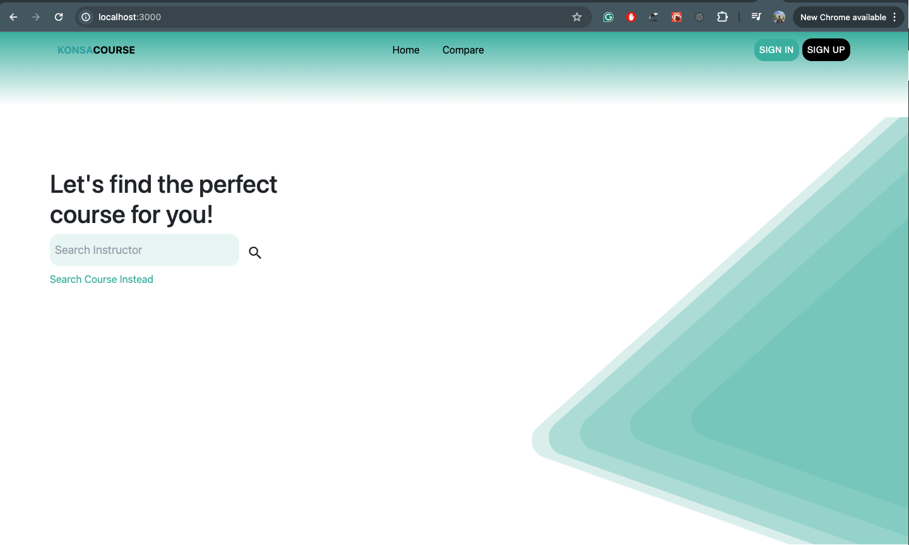

# Konsa Course

The purpose of this project is to help university students rate their professors and the courses.



## Installation

To run the project, go to the frontend directory and run the following command:

```sh
npm i
```

To run the front-end of the application, type :

```sh
npm run start
```

Your application should be running at _localhost:3000_

To install the packages in backend go to the backend directory and run the following command:

```sh
npm i
```

To run the back-end , type:

```sh
npm run start
```

Your back-end should be running at _localhost:3001_

```

```
